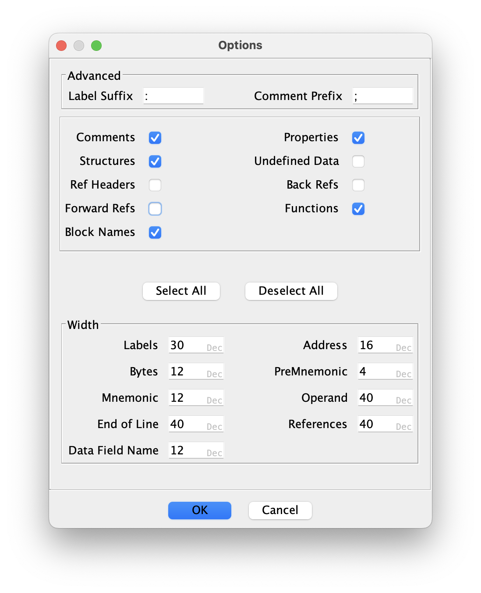

# Ghidra-To-Asm-Converter
Convert result of Ghidra disassembled binary into Assembler format. 
Platform supporting 
 - x86 [nasm](https://www.nasm.us)
 - z80 [sjasm](https://github.com/Konamiman/Sjasm)

Mainly targeted to x86 16 bit real mode code but should works for any x86 binary and even for z80.

You should export disassembled code from Ghidra in Ascii with following options
<figure></figure> and may be correct field length if data is truncated.

## Usage
Download jar file from releases and pass exported file with processor type as arguments. There is also option to pass output file name. If you want duplicate output to screen just add the -e key as optional parameter.
```
java -jar GhidraToAsmConverter-1.0.1.jar source.txt destination.asm -c X86
```
## Limitations
 - labels for function should be added manually
 - structure definition not works correctly
 - index register need manual fix with changed wrong offset operator
